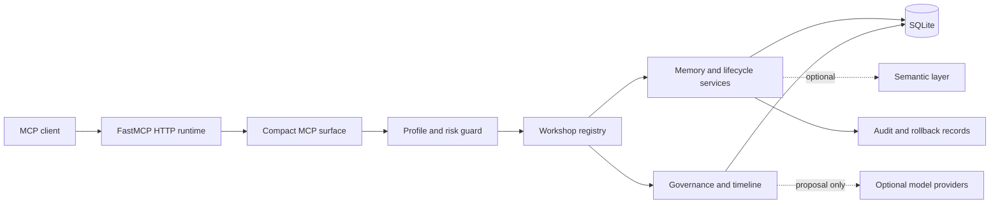

# MAPI

**Auditable memory and governance for AI agents**

MAPI is an auditable memory, lifecycle and governance server for AI agents, exposed through the Model Context Protocol (MCP).

> Status: **Public Release Candidate / Developer Preview**

Licensed under Apache License 2.0.

## Why durable agent memory needs governance

Chat history is session context, not a durable and inspectable memory system. A vector index can improve similarity search, but it does not establish provenance, current state, supersession, review policy, conflict handling or rollback. MAPI treats writes as explicit operations, preserves lineage and puts dangerous maintenance behind permissions and preview-oriented workflows.

## What MAPI provides

- durable, project-aware memories and lexical retrieval;
- relationships, provenance and memory timelines;
- lifecycle state, lineage and supersession;
- guarded preview/apply/rollback workflows;
- conflict detection, review and capture reconciliation;
- retention, quality and owner-governance tools;
- optional semantic retrieval and model-provider integrations;
- proposal-only Sandman maintenance;
- fail-closed permission profiles and compact MCP workshops.

## What MAPI is not

MAPI is not a hosted SaaS, an autonomous agent, an LLM, or merely a vector database. It does not replace application-level authentication or authorization. The local admin surface is powerful and must not be exposed remotely without an independent security boundary.

## Architecture



The thin entry point is [`server.py`](server.py). Runtime composition lives in `app/runtime`, action metadata in `app/workshops`, and business operations in `app/memory` and related service modules.

## Safety model

```text
preview -> explicit apply -> audit -> rollback
```

Workshop actions carry risk classes (`R0` through `R3`) and minimum profiles. Unknown profiles fail closed to `reader`. The default `agent` profile cannot access the admin workshop. Selecting `admin` also requires `MAPI_ADMIN_TOOLS_ENABLED=true`. External provider output is untrusted, validated and proposal-only; providers are disabled by default.

## Five-minute quickstart

Python 3.11 or 3.12 is required.

```bash
python -m venv .venv
```

Windows PowerShell:

```powershell
.venv\Scripts\Activate.ps1
python -m pip install --upgrade pip
pip install -e .
mapi-migrate
mapi-seed-demo
mapi-doctor
mapi-server
```

Linux:

```bash
source .venv/bin/activate
python -m pip install --upgrade pip
pip install -e .
mapi-migrate
mapi-seed-demo
mapi-doctor
mapi-server
```

The server binds to `http://127.0.0.1:8015/mcp/`. The quickstart performs no external model calls and does not download a model.

In another shell, run the verified protocol smoke:

```bash
python scripts/smoke_mcp.py
```

The smoke writes one deterministic fictional verification memory, searches and
reads it, inspects links and verifies that the admin workshop is denied.

## MCP client connection

Generic client configuration:

```json
{
  "mcpServers": {
    "mapi": {
      "url": "http://127.0.0.1:8015/mcp/",
      "transport": "http"
    }
  }
}
```

The endpoint and HTTP transport are verified. No named third-party client integration is claimed by this release candidate. See [MCP integration](docs/MCP_INTEGRATION.md).

## Example workflow

1. Call `bootstrap_agent_context` for `demo-project`.
2. Search with `find_memories`.
3. Inspect a selected memory and its links.
4. Save an explicitly authorized memory or submit a proposal.
5. Preview a lifecycle or retention action.
6. Apply only with an authorized profile and explicit approval.
7. Inspect the audit/timeline record and retain rollback material.

## Capability overview

| Workshop | Purpose |
|---|---|
| `memory` | Memory creation, retrieval, lineage, lifecycle and retention |
| `timeline` | Project and memory event history |
| `conflicts` | Conflict reports and guarded decisions |
| `governance` | Quality, queues, SLA and observability |
| `owner_catalog` | Owner catalogue and responsibility checks |
| `feature_flags` | Flag inspection and controlled updates |
| `research_ingest` | Quarantined research review |
| `semantic` | Optional semantic retrieval |
| `sandman` | Deterministic and proposal-only maintenance |
| `memory_linking` | Previewed deterministic linking |
| `gemma` | Optional local-model worker functions |
| `admin` | Dangerous local operator functions, hidden by default |

The authoritative generated catalogue is [docs/CAPABILITIES.md](docs/CAPABILITIES.md).

## Technology stack

- Python 3.11/3.12;
- FastMCP and its HTTP runtime;
- SQLite;
- Pydantic;
- optional `sqlite-vec` and `sentence-transformers`;
- optional Google GenAI and JSON repair support.

## Documentation

- [Installation](docs/INSTALLATION.md)
- [Configuration](docs/CONFIGURATION.md)
- [Architecture](docs/ARCHITECTURE.md)
- [MCP integration](docs/MCP_INTEGRATION.md)
- [Implementation guide](docs/IMPLEMENTATION_GUIDE.md)
- [Data model](docs/DATA_MODEL.md)
- [Security model](docs/SECURITY_MODEL.md)
- [Operations](docs/OPERATIONS.md)
- [Deployment](docs/DEPLOYMENT.md)
- [Troubleshooting](docs/TROUBLESHOOTING.md)
- [Development](docs/DEVELOPMENT.md)
- [Dependencies](docs/DEPENDENCIES.md)
- [Known limitations](docs/KNOWN_LIMITATIONS.md)
- [Public export manifest](docs/PUBLIC_EXPORT_MANIFEST.md)
- [Public release audit](docs/PUBLIC_RELEASE_AUDIT.md)

## Security and privacy

The default bind is loopback-only and the default profile is `agent`. No real memories, database, logs, backups, tokens or private deployment configuration are included. Review [SECURITY.md](SECURITY.md) and the [security model](docs/SECURITY_MODEL.md) before changing network exposure or profiles.

## Development and tests

```bash
pip install -e ".[dev]"
pytest
ruff check .
python scripts/audit_public_repository.py
git diff --check
```

Regenerate the capability catalogue after workshop changes:

```bash
mapi-capabilities
```

## Known limitations

- SQLite has single-writer characteristics.
- This release is single-instance and does not provide public multi-tenant onboarding.
- Semantic retrieval and model providers are optional and may require network downloads or credentials.
- Admin tools require an external authentication boundary for any non-local deployment.
- Docker packaging and macOS verification are not included in this candidate.
- Some schema migrations retain compatibility tables from earlier private development; inactive product flows are not exported.

## Roadmap

- complete manual publication review;
- reduce compatibility-only schema and code behind explicit migrations;
- expand clean-install and client integration coverage;
- add tested container packaging.

## License

MAPI is licensed under the [Apache License 2.0](LICENSE). See the
[licensing guide](docs/LICENSING.md) for redistribution and contribution terms.
