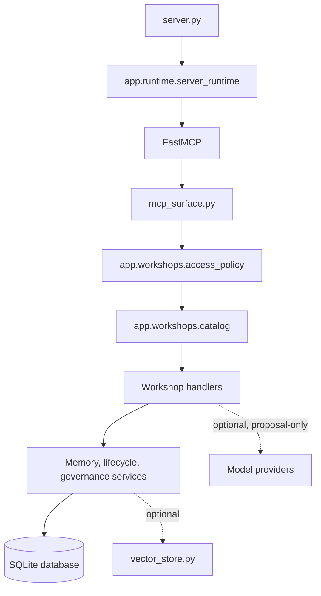

# Architecture

MAPI is a local-first MCP server with a compact public surface over a larger workshop registry.

## Runtime composition

- `server.py` is a compatibility facade and process entry point.
- `app/runtime/context.py` owns root, data and database paths.
- `app/runtime/server_runtime.py` composes final handlers, migrations, writer guard and HTTP transport.
- `mcp_surface.py` limits top-level tools and workshop actions.
- `app/workshops/access_policy.py` assigns profiles, risk classes and backup requirements.
- `app/workshops/runtime_registry.py` verifies handler completeness.

## Service boundaries

`app/memory` contains retrieval, relationships, current-state, lifecycle, reconciliation, retention and write routing. `app/timeline.py` records event history. `app/sandman` contains a deterministic core plus optional proposal-only providers. `app/admin` contains dangerous local tooling; it is inaccessible to the default profile.

## Persistence

MAPI uses SQLite and applies the ordered chain in `app/db_migrations.py`. The public quickstart creates a new database. The repository never ships a populated database.

## Optional capabilities

Semantic retrieval imports its dependencies lazily. Gemini imports the provider SDK only after explicit enablement and configuration. Missing extras disable only their capability.
